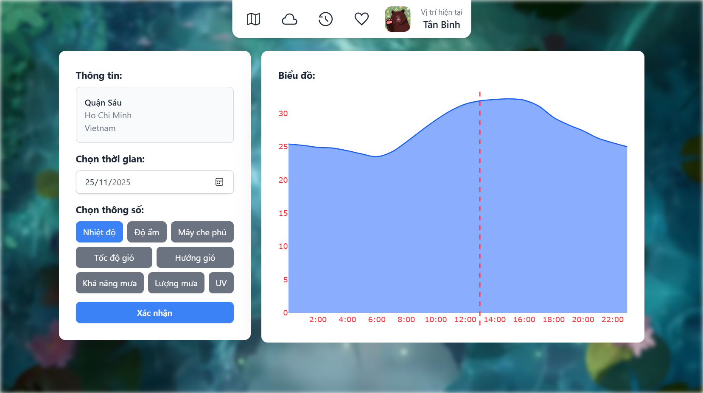
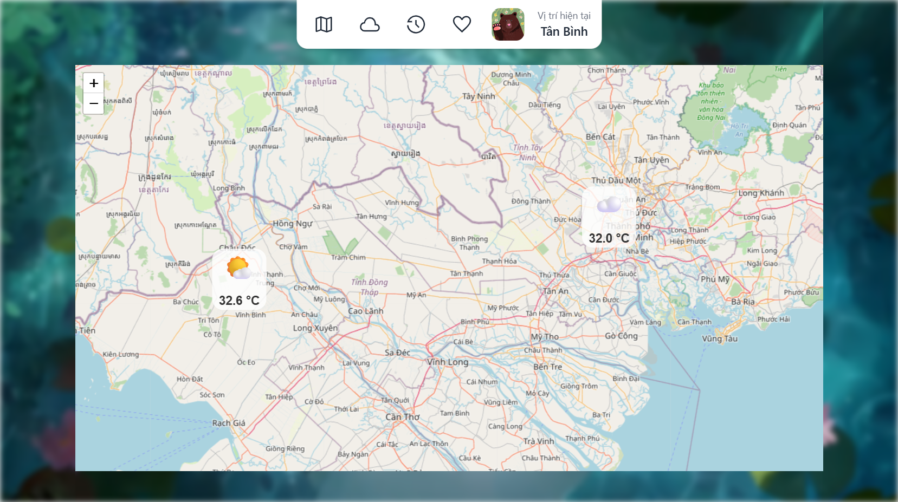

# may-mua-nang

The weather website.

## Preview

### Login


### Me


### Search


### Search result


### Detail



### Map



## Setup

> Change the terminal to `Bash`

Install packages:

```bash
# Create virtual environment
python -m venv venv

# Activate venv
source venv/Scripts/activate

# Install packages
pip install -r requirements.txt
```

Initialize config file and fill it (or copy and paste the whole file):

```bash
mkdir -p instance
touch instance/config.py
```

Initialize environment file and fill it (or copy and paste the whole file):

```bash
touch .env
```

Run:

```bash
python run.py
```
